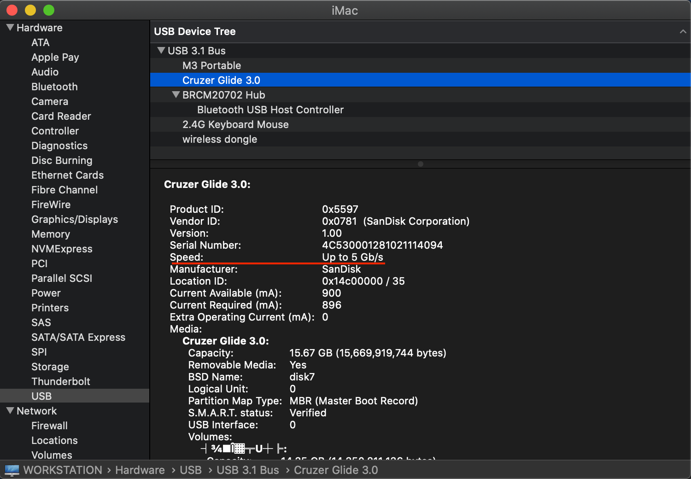

# B360M-AORUS-PRO-Hackintosh-Opencore

⚠️**注意：`config.plist`中的三码已被移除，请自行生成三码！！！**

## 主机配置

- CPU：英特尔 i7-8700
- 主板：技嘉 B360 M AORUS PRO
- 内存：金士顿 HyperX DDR4 16GB 2666MHz (HX426C16FB/16) *2
- 显卡：蓝宝石 RX 590 8G D5
- 固态：西部数据 SN750 500GB、英睿达 P1 1TB
- 电源：先马金牌 600W
- 散热器：九州风神大霜塔
- 显示器：LG UL550-W
- 无线网卡+蓝牙：BCM94360CD

## 实现功能

- AirDrop
- USB 3.0
- CPU变频
- 休眠
- FCPX硬件加速
- ...

可直接在设置中升级系统，暂未发现任何问题

P.S. 因为直接使用DP口输出的，没有测试过HDMI

